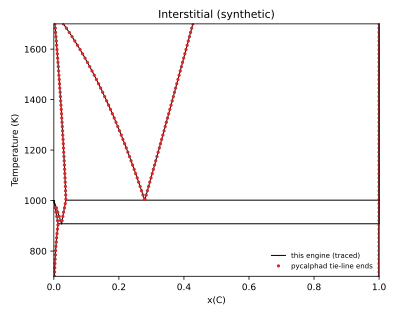
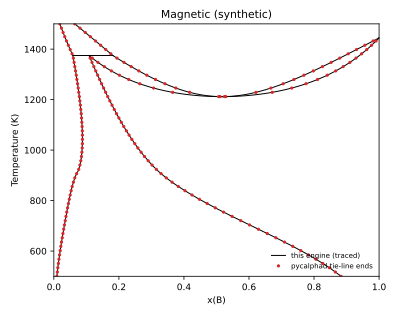
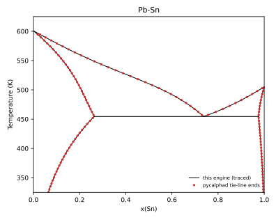
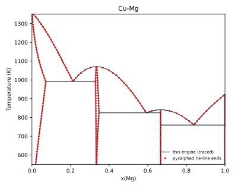
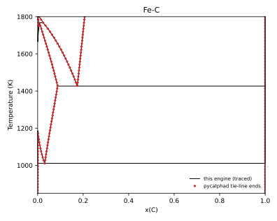

# Engine cross-validation against pycalphad

Generated by `python -m phase_diagram_explorer.validation` with phase-diagram-explorer 0.2.1 and pycalphad 0.11.2. The tests in `tests/validation/` check the same quantities (marker `validation`).

Both engines read the same TDB files. The Ag-Cu and Al-Cu fixtures are the provisional example systems exported with `write_tdb`; the other files in `tests/fixtures/` are synthetic. None of them is literature data. The literature databases are pycalphad's own test databases (not copied into this repository); their provenance is listed below. This comparison checks that the engine solves the models correctly, not that any model is right.

**Gas constant.** This engine uses each system's own R: 8.31451 J/(mol K) for TDB files by default (the fixtures exported from JSON keep 8.314462618 in their `.meta.json`). pycalphad always uses 8.3145. The R of each comparison is listed; the Gibbs energy check uses pycalphad's R on both sides.

## Systems and models

| System | File | Models exercised |
|---|---|---|
| Ag-Cu (provisional) | `tests/fixtures/ag_cu_provisional.tdb` | substitutional |
| Al-Cu (provisional) | `tests/fixtures/al_cu_provisional.tdb` | substitutional, compound |
| Regular solution | `tests/fixtures/regular_solution.tdb` | miscibility gap |
| Gap eutectic | `tests/fixtures/gap_eutectic.tdb` | miscibility gap |
| Interstitial (synthetic) | `tests/fixtures/interstitial.tdb` | (A)1(C,VA)1, (A)1(C,VA)3, pure C |
| Magnetic (synthetic) | `tests/fixtures/magnetic.tdb` | ferro- and antiferromagnetic BCC/FCC, composition-dependent TC and BMAGN |
| Pb-Sn | pycalphad `pbsn.tdb` | substitutional |
| Cu-Mg | pycalphad `cumg.tdb` | Laves (CU,MG)2(CU,MG)1 with an internal degree of freedom and wildcard parameters, (CU,MG)1(VA)1, (MG)1(VA)0.5, compound |
| Fe-C | pycalphad `cfe_broshe.tdb` | interstitial (FE)1(C,VA)1, (FE)1(C,VA)3, (FE)1(C,VA)0.5; magnetic BCC, FCC and carbides; compounds; pure C; pressure-dependent functions |

### Literature databases

- **Pb-Sn** (`pbsn.tdb`): T.L. Ngai and Y.A. Chang, CALPHAD 5 (1981) 267-276; TDB file by T. Abe, K. Hashimoto and Y. Sawada (NIMS, 2011).
- **Cu-Mg** (`cumg.tdb`): P. Liang et al., CALPHAD 22 (1998) 527-544, with the parameters of C.A. Coughanowr et al., Z. Metallkde. 82 (1991) 574-581 (parameter set 3); TDB file by M. Palumbo, T. Abe and K. Hashimoto (NIMS, 2008).
- **Fe-C** (`cfe_broshe.tdb`): B. Hallstedt et al., CALPHAD 34 (2010) 129-133 (Fe-C), with the equation of state of E. Brosh et al., CALPHAD 31 (2007) 173-185, and A.T. Dinsdale, CALPHAD 15 (1991) 317-425 (references as listed in the file).

## Gibbs energies at the same site fractions

Every phase at 6 random site-fraction sets and T = 400, 900 and 1400 K, both engines with R = 8.3145. Maximum |G difference| in J/mol of atoms.

| System | Phases | Max difference (J/mol) |
|---|---|---|
| Ag-Cu (provisional) | 3 | 9.1e-13 |
| Al-Cu (provisional) | 3 | 9.2e-13 |
| Regular solution | 1 | 9.1e-13 |
| Gap eutectic | 2 | 1.4e-12 |
| Interstitial (synthetic) | 4 | 5.5e-12 |
| Magnetic (synthetic) | 3 | 8.5e-09 |
| Pb-Sn | 3 | 5.8e-11 |
| Cu-Mg | 5 | 4.4e-11 |
| Fe-C | 8 | 1.3e-07 |

## Equilibrium at 30 (T, x) points per system

A grid of 6 temperatures (the range less 25 K at each end) by five compositions per system. Phases are compared by name, ordered by composition (composition sets of one phase compare as two phases of that name). Tolerance: 1e-3 on phase fractions and compositions.

| System | R here | T range (K) | x | Same stable phases | Max fraction difference | Max composition difference |
|---|---|---|---|---|---|---|
| Ag-Cu (provisional) | 8.314462618 | 500-1450 | 0.05, 0.27, 0.5, 0.73, 0.95 | 30/30 | 1.5e-06 | 1.1e-06 |
| Al-Cu (provisional) | 8.314462618 | 500-1450 | 0.05, 0.27, 0.5, 0.73, 0.95 | 30/30 | 1.7e-05 | 4.1e-06 |
| Regular solution | 8.314462618 | 600-1400 | 0.05, 0.27, 0.5, 0.73, 0.95 | 30/30 | 7.3e-06 | 4.6e-06 |
| Gap eutectic | 8.314462618 | 600-1100 | 0.05, 0.27, 0.5, 0.73, 0.95 | 30/30 | 1.8e-06 | 1.1e-06 |
| Interstitial (synthetic) | 8.31451 | 700-1700 | 0.002, 0.01, 0.03, 0.2, 0.6 | 30/30 | 4.6e-07 | 1.5e-07 |
| Magnetic (synthetic) | 8.31451 | 500-1500 | 0.05, 0.27, 0.5, 0.73, 0.95 | 30/30 | 4.6e-07 | 3.1e-07 |
| Pb-Sn | 8.31451 | 325-625 | 0.05, 0.27, 0.5, 0.73, 0.95 | 30/30 | 1.5e-06 | 9.4e-07 |
| Cu-Mg | 8.31451 | 550-1350 | 0.05, 0.27, 0.5, 0.73, 0.95 | 30/30 | 4.0e-06 | 5.3e-07 |
| Fe-C | 8.31451 | 850-1800 | 0.002, 0.01, 0.03, 0.12, 0.5 | 30/30 | 1.7e-06 | 1.3e-07 |

## Invariant reactions

This engine root-finds the three-phase condition. The pycalphad value is the temperature at which the reacting phase P2 appears or disappears at a composition between P1 and P2 (inside the reaction line), bisected on pycalphad equilibria to 0.01 K. Tolerance: 0.5 K.

| System | Reaction | Phases | This engine (K) | pycalphad (K) | Difference (K) |
|---|---|---|---|---|---|
| Ag-Cu (provisional) | eutectic | FCC_AG + LIQUID + FCC_CU | 1051.739 | 1051.734 | 0.005 |
| Al-Cu (provisional) | eutectic | FCC_AL + LIQUID + AL2CU | 930.306 | 930.302 | 0.005 |
| Gap eutectic | eutectic | ALPHA#1 + LIQUID + ALPHA#2 | 643.192 | 643.118 | 0.073 |
| Interstitial (synthetic) | eutectoid | BCC_A2 + FCC_A1 + GRAPHITE | 908.074 | 908.079 | 0.005 |
| Interstitial (synthetic) | eutectic | FCC_A1 + LIQUID + GRAPHITE | 1001.456 | 1001.461 | 0.005 |
| Magnetic (synthetic) | peritectic | BCC_A2 + FCC_A1 + LIQUID | 1374.768 | 1374.763 | 0.005 |
| Pb-Sn | eutectic | FCC_A1 + LIQUID + BCT_A5 | 454.562 | 454.567 | 0.005 |
| Cu-Mg | eutectic | CUMG2 + LIQUID + HCP_A3 | 759.578 | 759.583 | 0.005 |
| Cu-Mg | eutectic | CU2MG + LIQUID + CUMG2 | 824.483 | 824.488 | 0.005 |
| Cu-Mg | eutectic | FCC_A1 + LIQUID + CU2MG | 992.014 | 992.019 | 0.005 |
| Fe-C | eutectoid | BCC_A2 + FCC_A1 + GRAPHITE | 1011.172 | 1011.177 | 0.005 |
| Fe-C | eutectic | FCC_A1 + LIQUID + GRAPHITE | 1426.584 | 1426.589 | 0.005 |
| Fe-C | peritectic | BCC_A2 + FCC_A1 + LIQUID | 1767.764 | 1767.769 | 0.005 |

The gap eutectic is symmetric, so its temperature is also known analytically: the ideal LIQUID at x = 0.5 meets the horizontal common tangent of the two ALPHA composition sets. That gives 643.192 K with R = 8.314462618, 643.191 K with R = 8.3145. This engine matches it; pycalphad's bisected value is about 0.07 K lower, which the gas constant accounts for only 0.001 K of.

## Miscibility gap binodal (regular solution, L0 = 20000 J/mol)

Both composition sets at x = 0.5. Tolerance: 1e-3.

| T (K) | This engine | pycalphad | Max difference |
|---|---|---|---|
| 800 | 0.070089, 0.929911 | 0.070091, 0.929909 | 1.2e-06 |
| 1000 | 0.169141, 0.830859 | 0.169144, 0.830856 | 3.1e-06 |
| 1150 | 0.321882, 0.678118 | 0.321890, 0.678110 | 8.4e-06 |

## Phase boundaries

Lines: boundaries traced by this engine. Points: two-phase tie-line end points from pycalphad equilibria on a 60 x 201 (T, x) grid. Fields narrower than the grid spacing (e.g. the Al-rich LIQUID + FCC_AL field in Al-Cu) can be missed by the pycalphad grid.

