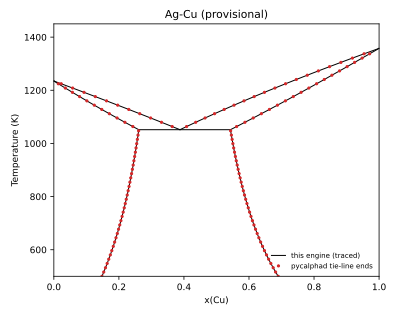
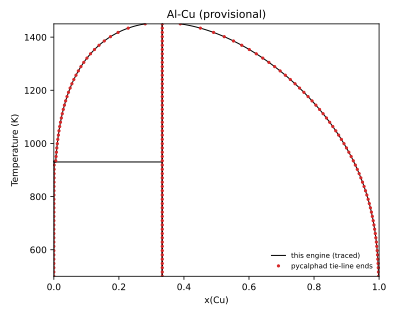
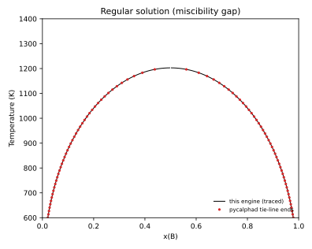
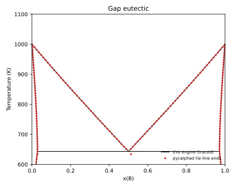

# Engine cross-validation against pycalphad

Generated by `python -m phase_diagram_explorer.validation` with phase-diagram-explorer 0.2.0 and pycalphad 0.11.2. The tests in `tests/validation/` check the same quantities (marker `validation`).

Both engines read the same TDB fixtures in `tests/fixtures/`. The Ag-Cu and Al-Cu fixtures are the provisional example systems exported with `write_tdb`; they are test fixtures, not literature data. This comparison checks that the engine solves the model correctly, not that the model is right.

## Equilibrium at 30 (T, x) points per system

A grid of 6 temperatures (the system range less 25 K at each end) by compositions x = 0.05, 0.27, 0.5, 0.73, 0.95. Phases are compared by name, ordered by composition (composition sets of one phase compare as two phases of that name). Tolerance: 1e-3 on phase fractions and on phase compositions.

| System | Points | Same stable phases | Max phase fraction difference | Max phase composition difference |
|---|---|---|---|---|
| Ag-Cu (provisional) | 30 | 30/30 | 1.5e-06 | 1.1e-06 |
| Al-Cu (provisional) | 30 | 30/30 | 1.7e-05 | 4.1e-06 |
| Regular solution (miscibility gap) | 30 | 30/30 | 7.3e-06 | 4.6e-06 |
| Gap eutectic | 30 | 30/30 | 1.8e-06 | 1.1e-06 |
| Pb-Sn (Ngai and Chang, CALPHAD 5 (1981) 267; pycalphad test database) | 30 | 30/30 | 5.5e-06 | 3.5e-06 |

The Pb-Sn row uses a literature assessment from pycalphad's own test databases (not copied into this repository), over 325-625 K. Its Gibbs energies agree with pycalphad's to 1e-6 J/mol once pycalphad's gas constant (8.3145 J/(mol K), against 8.314462618 here) is allowed for in the ideal mixing term.

## Eutectic temperatures

This engine root-finds the three-phase condition. The pycalphad value is the temperature at which LIQUID appears on heating at a composition inside the eutectic line, bisected on pycalphad equilibria to 0.001 K. Tolerance: 0.5 K.

| System | x | This engine (K) | pycalphad (K) | Difference (K) |
|---|---|---|---|---|
| Ag-Cu (provisional) | 0.4 | 1051.739 | 1051.739 | 0.000 |
| Gap eutectic | 0.5 | 643.192 | 643.122 | 0.070 |
| Pb-Sn | 0.6 | 454.562 | 454.562 | 0.000 |

The gap eutectic is symmetric, so its temperature is also known analytically: the ideal LIQUID at x = 0.5 meets the horizontal common tangent of the two ALPHA composition sets. That gives 643.192 K with R = 8.314462618, 643.191 K with R = 8.3145. This engine matches it; pycalphad's bisected value is about 0.07 K lower, which the gas constant accounts for only 0.001 K of.

## Miscibility gap binodal (regular solution, L0 = 20000 J/mol)

Both composition sets at x = 0.5. Tolerance: 1e-3.

| T (K) | This engine | pycalphad | Max difference |
|---|---|---|---|
| 800 | 0.070089, 0.929911 | 0.070091, 0.929909 | 1.2e-06 |
| 1000 | 0.169141, 0.830859 | 0.169144, 0.830856 | 3.1e-06 |
| 1150 | 0.321882, 0.678118 | 0.321890, 0.678110 | 8.4e-06 |

## Phase boundaries

Lines: boundaries traced by this engine. Points: two-phase tie-line end points from pycalphad equilibria on a 60 x 201 (T, x) grid. Fields narrower than the grid spacing (the Al-rich LIQUID + FCC_AL field in Al-Cu) can be missed by the pycalphad grid.

